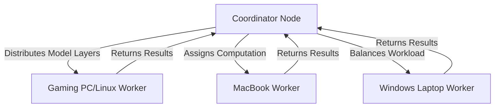

# DistributedLLM 🌐🧠

> *Harness the collective power of heterogeneous hardware to run large language models beyond the capabilities of any single machine.*

[](https://opensource.org/licenses/MIT)


## 🔮 Vision

DistributedLLM brings the power of supercomputing to your personal hardware collection. By combining the computational resources of diverse machines—from powerful desktops to modest laptops, across Windows, macOS, and Linux—our framework enables running inference on large language models that would typically require expensive specialized hardware.

**Think SETI@home, but for AI.**

## 🧩 How It Works

DistributedLLM implements a dynamic "Boss-Workers" model inspired by high-performance computing techniques for heterogeneous clusters:



1. **Smart Partitioning**: The model is dynamically split across available machines based on their computational power and memory capacity
2. **Adaptive Load Balancing**: Work distribution automatically adjusts as machine availability and performance fluctuate
3. **Efficient Communication**: Optimized data transfer protocols minimize network overhead
4. **Unified Interface**: Single control point abstracts away the complexity of the distributed system

## ✨ Key Features

- **Truly Heterogeneous**: Run across Windows, macOS, and Linux machines simultaneously
- **Containerized Compatibility**: Docker support for consistent environment handling
- **Dynamic Scaling**: Add or remove machines on the fly
- **Performance Monitoring**: Real-time visualization of distributed workload
- **Fault Tolerance**: Graceful handling of machine disconnections
- **Minimal Setup**: Simple configuration with automatic capability detection

## 🚀 Getting Started

### Prerequisites

- Python 3.9+
- Network connectivity between all machines
- Git

### Quick Start

1. Clone the repository:
   ```bash
   git clone https://github.com/yourusername/distributed-llm.git
   cd distributed-llm
   ```

2. Set up the coordinator (on your most reliable machine):
   ```bash
   ./scripts/setup_coordinator.sh
   ```

3. Set up workers (on each participating machine):
   ```bash
   # For Linux
   ./scripts/setup_worker_linux.sh
   
   # For macOS
   ./scripts/setup_worker_mac.sh
   
   # For Windows (run in Command Prompt)
   scripts\setup_worker_windows.bat
   ```

4. Edit the configuration:
   ```bash
   nano config/cluster_config.yaml
   ```

5. Start the system:
   ```bash
   python src/main.py
   ```

## 🌟 Use Cases

- **Research Exploration**: Run cutting-edge LLMs on your existing hardware collection
- **Collaborative Computing**: Pool resources within research groups or among friends
- **Cost-Effective Inference**: Avoid cloud computing costs by utilizing hardware you already own
- **Educational Tool**: Learn about distributed systems and machine learning
- **Hardware Recycling**: Give new purpose to older machines as dedicated inference nodes

## 📊 Performance

Performance varies based on your hardware mix, network conditions, and model configuration. Here are some example benchmarks:

| Cluster Composition | Model Size | Tokens/second | Speedup vs. Best Single Machine |
|---------------------|------------|---------------|--------------------------------|
| 1 Gaming PC, 2 MacBooks | 7B | 12.3 | 2.4x |
| 2 Gaming PCs, 1 Linux Server, 1 MacBook | 13B | 8.7 | 3.1x |
| 3 Gaming PCs, 2 MacBooks, 1 Linux Server | 30B | 4.2 | 4.8x |

## 🛠️ Architecture

DistributedLLM uses a layered architecture:

- **Coordinator Layer**: Orchestrates the distribution of work
- **Communication Layer**: Handles cross-platform networking
- **Compute Layer**: Manages the actual model inference
- **Monitoring Layer**: Tracks performance and adjusts workload distribution

## 🤝 Contributing

Contributions are welcome! See [CONTRIBUTING.md](CONTRIBUTING.md) for details on our code of conduct and submission process.

## 📜 License

This project is licensed under the MIT License - see the [LICENSE](LICENSE) file for details.

## 🌐 Citation

If you use DistributedLLM in your research, please cite:

```bibtex
@software{DistributedLLM2023,
  author = {Your Name},
  title = {DistributedLLM: Heterogeneous Distributed Computing for Large Language Models},
  year = {2023},
  url = {https://github.com/yourusername/distributed-llm}
}
```

## ✉️ Contact

Questions? Ideas? Reach out!

- GitHub Issues: Preferred for technical questions and bug reports
- Email: your.email@example.com

---

*"Alone we can do so little; together we can do so much." – Helen Keller*